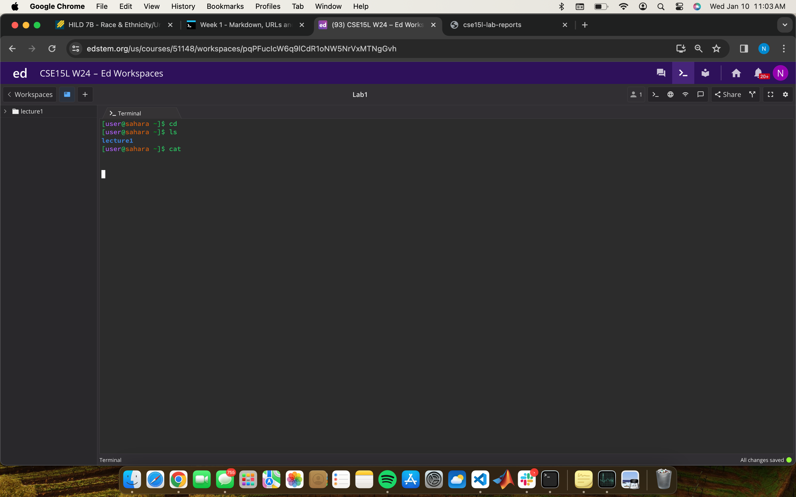
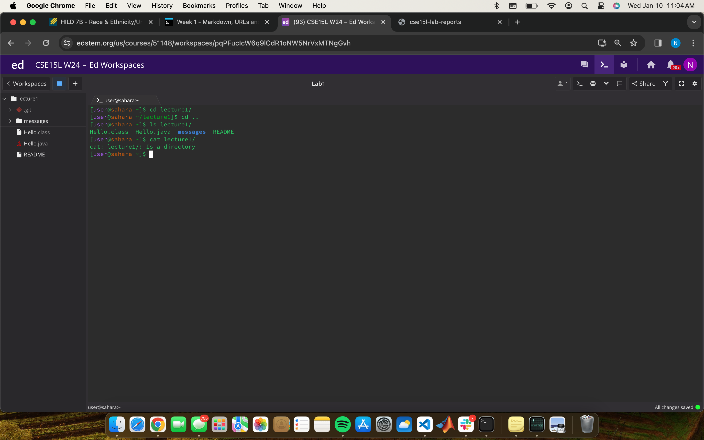
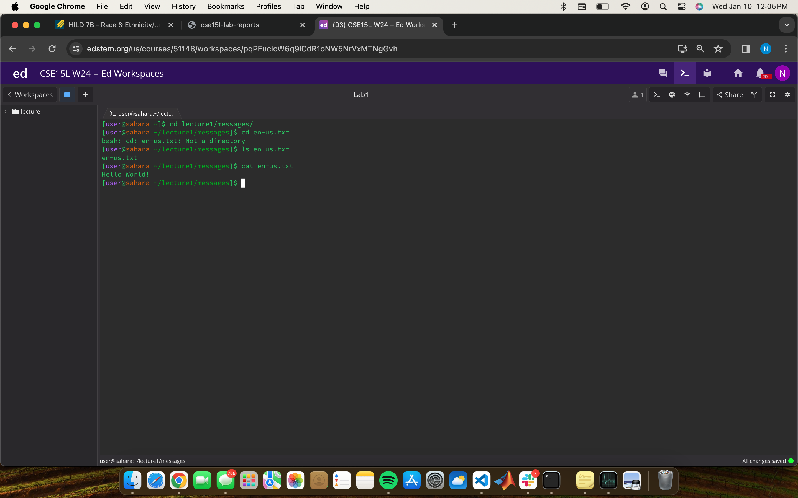

_Hello_

__Welcome to Week 1__

This is a my Lab 
=========
Here is the link to my github profile [Link](https://github.com/nora-zajzon)

This is my Dog Cherry
---------

> I have two dogs but I wanted to use this picture

Classes I am taking this quarter:
---
* CSE 15L
* CSE 20
* CSE 12
* HILD 7B
* MCWP 50
* Independent Research
  
`Units:` 19 total

```
This is the end of the rambling
Next are my answers to the lab questions
```

No Arguments
=========


1) `cd` The output of this command line was expected as no directory was selected. Therefore, when cd is used and no argument is given, no change in directory will be made. This is not an error.
2) `ls` The output of this command line was expected to return the files and directories in the current directory. Since the current directory is /home, it will only list lecture1 since it is the only directory or file in /home. This is not an error.
3) `cat` The output of this command line was expected since no file was given as an argument. Since there is nothing to concatenate or print, the command is unable to return. This is an error in the sense that the command can not terminate so the terminal can not return to the command line.

Command with a path to a directory as an argument
=========


1) `cd lecture1/` The output of this command line was expected as the directory lecture1 was as an argument. Therefore, the current directory will be changed to the lecture1 directory. This is not an error.
2) `ls lecture1/` The output of this command line was expected to return the files and directories in the current directory. Since the current directory is /home/lecture1, it will list all of the files and directories within lecture1. This is not an error.
3) `cat lecture1/` The output of this command line was expected since no file was given as an argument. Since a directory is given instead of a file, the terminal will automatically state that the argument given is a directory. This is an error in the sense the command of cat is not carried through since it can not print the content of a file.

Command with a path to a file as an argument
=========


1) `cd lecture1/messages/en-us.txt` The output of this command line was expected as the file en-us.txt was as the argument. Therefore, the current directory cannot change to a file and will remain the same. This is an error in the sense that the current directory is not changed to the file given as an argument.
2) `ls lecture1/messages/en-us.txt` The output of this command line was expected to return the files and directories in the current directory. However, if a file is given as the argument, there are no files or directories within it to list. This is an error in the sense that nothing will be listed as a result of the command other than the file you are in.
3) `cat lecture1/messages/en-us.txt` The output of this command line was expected a file was given as an argument in the command. The terminal will print the content of the file. This is not an error.
