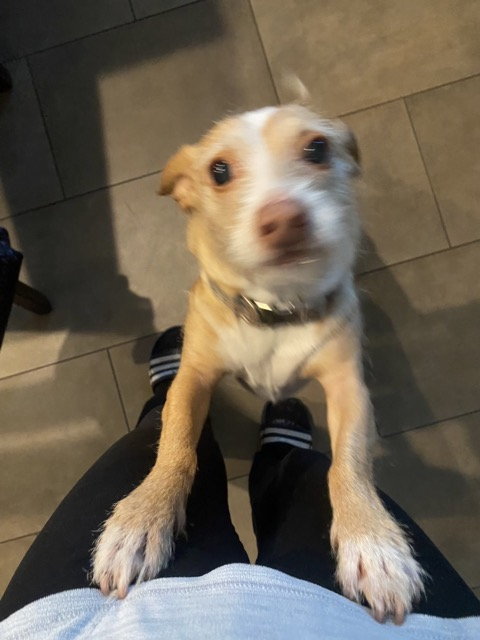

this is the second file i have to make

_Testing the Italic_

__Now Bold__

This is a Heading 
=========
This is a SubHeader
---------
Here is the link to my github website [Link](https://nora-zajzon.github.io/cse15l-lab-reports/)


> Random Blockquote
* This
* Is
* A
* List
Horizontal rule:
---
`Inline code` then words that are not in it
```
# code block
this is the end
```
